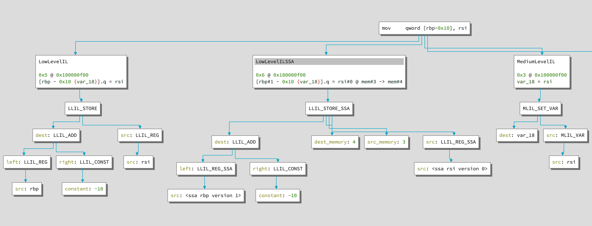

# Reversing Age of Empires 2

Upgrading tools from Dark Age to Castle Age

<!--
00:20

- Welcome to the presentation
- Topic: Reverse Engineering Age of Empires 2: Definitive Edition
- The journey: Upgrading tools from manual analysis (Dark Age) to automation (Castle Age)
-->

---
layout: two-cols-header
---

# Teaser

<style>
img.fit { max-height: 60%; }
</style>

::left::


::right::


---

# Disclaimer

* Not affiliated with Microsoft
* Project for fun and learning

<!--
00:10

- Standard disclaimer: Not affiliated with Microsoft or the game studios
- Side project driven by fun and learning
-->

---
layout: intro
---

# Bio

* Carl "ZetaTwo" Svensson, 34
* Swedish Londoner
* Security Engineer in finance
* CTF veteran
  * Org: Google CTF, LiveCTF, ...
  * Player: HackingForSoju, NorseCode, ...
* Publications:
  * Blog / YouTube
  * PagedOut

<!--
00:30

- Who am I: Carl (ZetaTwo)
- Background: Security Engineer in finance, living in London
- Hobbies: CTF organizer and player
- Content creation: Blogs, YouTube, PagedOut
-->

---
layout: image-right
image: /images/aok-cover.jpg
---

# Age of Empires 2

Background

* RTS PC Game
* Released 1999 
  - Ensemble Studios (Microsoft)
* HD Remake 2013
  - Hidden Path Entertainment
* Definitive Edition 2019
  - Forgotten Empires et al
  - ~100 patches since
* I played on/off throughout my life
  - Came back to the game with DE
  - ~1000h played
  - Top ~20% competitive

<!--
00:40

- Brief history of the game
- Released 1999, HD remake 2013
- Focus today: Definitive Edition (2019)
- All based on the same codebase, but heavily modified over the years
-->

---
layout: section
---

<style>
    .section h1.age { font-size: 3rem; margin-bottom: 0; }
    .section h1 img { display: inline-block; max-height: 8rem; }
    .section { overflow: hidden; }
</style>

<h1 class="age">Dark Age</h1>

Manual exploration


<!--
00:20

- I have divided up this talk into sections corresponding to the ages you prgress through in the game
- We start in the "Dark Age"
- This represents the initial, manual exploration of the game binary
-->

---
layout: two-cols-header
---

# Initial Recon

::left::

* Strings
* Entropy
* Open in Binary Ninja

::right::

```
$ ls -lh AoE2DE_s.exe | awk '{print $5}'
79M

$ strings -n10 AoE2DE_s.exe
...
Furor Celtica
Siege Drill
Town Watch
Crenellations
Crop Rotation
Heavy Plow
Horse Collar
...

$ binwalk -E AoE2DE_s.exe
```

<!--
00:45

- Initial Reconnaissance
- 80MB binary (Windows PE)
- Strings check: We see game-related strings (not completely out of luck)
- Binwalk entropy check (-E): The critical finding
-->

---
layout: image
image: /images/aoe2_entropy1.png
backgroundSize: contain
transition: none
--- 

---
layout: image
image: /images/aoe2_entropy1_annotated.png
backgroundSize: contain
--- 

<!--
00:15

- Entropy Graph results
- High entropy across the majority of the file
- Implication: Compressed or Encrypted
- We have to tackle this immediately to analyze the game
-->

---
layout: image
image: /images/binaryninja_sections.png
backgroundSize: contain
--- 

<!--
- Opening in Binary Ninja
- Standard sections (.text, .data)
- Suspicious section: .text2 (This becomes relevant later)
-->

---

# Finding the decryption mechanism

* Dump decrypted binary with x64dbg
  - Reference
* Manual analysis
* Analyze decryption algorithm

<!--
- Confirmed: Binary is encrypted
- Initial strategy: Create a reference ("ground truth")
- Method: Run game, attach debugger, dump memory -> Decrypted Binary
- This confirms the scheme: Startup -> Decrypt -> Execute
-->

---
layout: image
image: /images/binaryninja_start.png
backgroundSize: contain
--- 

<!--
- Analysis of Entry Point
- Jump instruction leads to obfuscation
- Stack manipulation and 16-byte alignment
- "Binary-to-Binary" level obfuscation (blindly saves all registers)
-->

---
layout: image
image: /images/binaryninja_decrypt2.png
backgroundSize: contain
--- 

<!--
- Deeper in the function
- We see two critical function calls:
  1. Making memory pages writable (RWX)
  2. The actual code decryption
-->

---
layout: image
image: /images/aoe2_exports.png
backgroundSize: contain
--- 

<!--
- Mistake: 414 exported functions
- all call into the decryption
-->

---

# Analyzing the decryption mechanism

First iteration

1. Mark code RWX
2. Decrypt with AES

<br />

* Where is the key?
* What about relocations?

<!--
- The Mechanics: AES decryption with a hardcoded key
- The Conflict: Relocations vs Encryption
- If relocations are applied by the OS on encrypted data, the decryption will produce garbage
-->

---

# Analyzing the decryption mechanism

Second iteration

1. Mark code RWX
2. Use variable-length int table to collect ciphertext
3. Validate ciphertext integrity
4. Decrypt with AES-ECB using hard-coded key
5. Put back using table

<br />

* Tail is stored separately
* Bonus: relocation-friendly stream cipher

<!--
- How they solved the relocation problem:
- A giant table tracks relocation spots
- The decryption algorithm *skips* these spots (only non-relocation bytes are encrypted)
- Process: Gather encrypted bits -> Integrity Hash -> AES-ECB -> Put bytes back
- Funny detail: Last block tail stored separately
-->

---

# Basic scripting to support

* Inject decrypted .text
* Copy GOT 

<!--
- Transitioning to tools
- Goal: Create a static, analyze-able binary without running the game
- Approach: Transplant the dumped memory sections back into the file
-->


---

# Inject Decrypted .text

```python
import lief
...
with open(TEXT_PATH, 'rb') as fin: text1_data = fin.read()
with open(TEXT2_PATH, 'rb') as fin: text2_data = fin.read()

exe = lief.parse(EXE_PATH)
text = exe.get_section('.text')

text = []
for section in exe.sections:
    if section.name == '.text':
        text.append(section)
assert len(text) == 2, len(text)

with open(EXE_PATH, 'rb') as fin:
    exe_data = bytearray(fin.read())

exe_data[text[0].offset:text[0].offset+text[0].size] = text1_data[:text[0].size]
exe_data[text[1].offset:text[1].offset+text[1].size] = text2_data[:text[1].size]

with open('AoE2DE_s.decrypted2.exe', 'wb') as fout:
    fout.write(exe_data)
```

<!--
- Using LIEF (Leaf) library for PE manipulation
- Copying the clean .text sections from the memory dump into the encrypted PE file
-->

---

# Copy GOT in Binary Ninja

```python

got_copy = [(47980544, 69856152, 41), (47980880, 69856488, 8), (47980952, 69856560, 1), ...]

BASE_ADDR = 0x140000000
for dst_addr, src_addr, num_elements in got_copy:
    for i in range(num_elements):
        src_offset = src_addr + 8*i
        dst_offset = dst_addr + 8*i
        data_var = bv.get_data_var_at(BASE_ADDR+src_offset)
        bv.define_user_data_var(BASE_ADDR+dst_offset, data_var.type, data_var.name)
        symbol = bv.get_symbol_at(BASE_ADDR+src_offset)
        bv.define_user_symbol(Symbol(symbol.type, BASE_ADDR+dst_offset, symbol.name))
        data = bv.read(BASE_ADDR+src_offset, 8)
        bv.write(BASE_ADDR+dst_offset, data)
```

<!--
- The .text2 section mentioned earlier contains code
- It requires the Global Offset Table (GOT)
- The decryption routine copies the GOT, so our script must do it too
-->

---
layout: image
image: /images/aoe2_entropy2.png
backgroundSize: contain
transition: none
---

---
layout: image
image: /images/aoe2_entropy2_annotated.png
backgroundSize: contain
---

<!--
- Resulting Entropy
- Most of the file is low entropy (decrypted)
- BUT: The end (.text2) is still high entropy
- Discovery: Two layers of encryption
-->

---

# Layer 2 Decryption

* TEA
* GOT table
* Work in progress

---
layout: section
---

<style>
    .section h1.age { font-size: 3rem; margin-bottom: 0; }
    .section h1 img { display: inline-block; max-height: 8rem; }
    .section { overflow: hidden; }
    .slidev-vclick-hidden {
        display: none;
    }
</style>

<h1 class="age">Feudal Age</h1>

Binary Ninja scripting

<v-click at="0" hide></v-click>
<v-click at="1"></v-click>


<!--
- Moving to "Feudal Age"
- Theme: Better tools and automation
- Goal: Stop doing manual work for every single game update/patch
-->

---

# Automated finding of parameters

* Describe the shape of the decryption code
* Traverse IL


<!--
- Goal: Automatically find keys and tables
- Method: Define the "Shape" of the code (e.g., function calls with specific arguments)
- Use Binary Ninja IL traversal to find these shapes
- Visualizing the target
- Identifying the AES setup call
- We can see the arguments (Key pointer, Constant 0x80)
-->

---

# Automated finding of parameters

```python
def aes_function_get_aes_key(aes_func: binaryninja.function.Function) -> Optional[int]:
    """Anayze AES function and get AES key address"""
    for ins in aes_func.mlil.instructions:
        if ins.operation != binaryninja.MediumLevelILOperation.MLIL_CALL:
            continue
        arguments = ins.operands[2]
        if len(arguments) != 3:
            continue
        if arguments[2].operation != binaryninja.MediumLevelILOperation.MLIL_CONST:
            continue
        if arguments[2].constant != 0x80:
            continue
        if arguments[1].operation != binaryninja.MediumLevelILOperation.MLIL_CONST_PTR:
            continue

        aes_key_va = arguments[1].constant
        break
    else:
        log.error("Unable to find AES setup call")
        return None
    return aes_key_va
```

<!--
- The Logic: A "Sieve" approach
- Loop over instructions -> Is it a CALL? -> Does it have 3 args? -> Is arg 2 a pointer?
- If matches -> Extract Key Address
-->

---

# Automated decryption

* Find parameters (Binary Ninja)
  * AES key VA
  * Ciphertext suffix VA
  * Ciphertext suffix len
  * Decrypt table VA
  * Target hash VA
  * Decryptor marker src VA
  * Decryptor marker dst VA
  * Sections marker VA
* Decrypt (lief)

<!--
- Summary of the pipeline
- We extract all these attributes (Keys, Tables, Hashes, Markers)
- Pass them to LIEF to perform the decryption
-->

---

# Find Offsets

```
$ python3 find-offsets.py AoE2DE_s.exe
Processing AoE2 exe at "AoE2DE_s.exe"
Entry function: 0x142bb07cc
Sections mod function: 0x140a8dcbc
Code decrypt function: 0x144f5e8b8
Section marker VA: 0x140526f5a
Decryption marker source VA: 0x140cbbcaa
Decryption marker destination VA: 0x1449297ae
AES key VA: 0x1417672cd
Target hash VA: 0x144f3cab3
Decryption table VA: 0x144965e0a
Ciphertext suffix VA: 0x144ea9e1f
Ciphertext suffix Length: 0xa
```

<!--
- Proof of Concept
- Running the script on a binary successfully extracts all needed offsets
-->

---

# Decrypt Binary

```
$ python3 decrypt-binary.py --input-path AoE2DE_s.exe --output-path AoE2DE_s.decrypted.exe --binary-parameters '{
    "aes_key_va": 5393248973,
    "ciphertext_suffix_va": 5451193887,
    "ciphertext_suffix_len": 10,
    "decrypt_table_va": 5445672458,
    "decryptor_marker_src_va": 5382061226,
    "decryptor_marker_dst_va": 5445425070,
    "target_hash_va": 5451795123,
    "sections_marker_va": 5374111578,
    "decrypt_table_data_src_va": null,
    "decrypt_table_data_dst_va": null,
    "got_marker_va": null
}'
Decryption table, VA: 0x144965e0a, offset: 0x469d80a
Ciphertext hash ok: 1d9fd9a570a1c7d20bb35880d59113fe2b9ed33b8f46282b4685e34614340a6f2bbebeee7ab353a3b2b50b2745e32336
Ciphertext suffix: 6c704cf2baf01917617e
Decrypted: 4053488b442440488bd94885c0745a4c...
```

<!--
- Validation
- The internal hash check passes
- The MZ header is visible in the output
-->

---

# Leveraging Steam DepotDownloader for CI

* Download every version of the game
* BONUS: unencrypted version
* Find decryption parameter for every version
* Decrypt every version of the game

<!--
- Scaling up
- Using Steam DepotDownloader to get *every* historical version (almost 100 binaries)
- Fun fact: Found a dev accident—one patch included a completely unencrypted binary! (Great reference)
-->

---

# Mass Find Decryption Parameters

```
$ python3 ./scripts/find_offsets_mass.py
INFO processing 8706369178041085088
INFO processing 6991182055832393170
ERROR Inconsistent decryption marker situation
ERROR failed to find parameters for version 6991182055832393170
INFO processing 3568369477204818532
INFO processing 8916508292174982468
INFO processing 620891448408726573
INFO processing 7959981682396439424
INFO processing 2176586667924974355
INFO processing 7673739171887156079
INFO processing 2164364554796430252
ERROR Unable to find suffix function
ERROR failed to find parameters for version 2164364554796430252
...
INFO successes: 80, failures: 16
```

<!--
- Running mass extraction
- Success on ~80 binaries, 16 failures
- Failures due to changes in obfuscation (e.g., JMP changing to CALL)
- Goal: 100% automated coverage
-->

---

# Mass Decrypt Binaries

```
$ python3 ./scripts/decrypt_binary_mass.py
INFO processing 8706369178041085088
INFO Decryption table, VA: 0x144363b67, offset: 0x3e5bd67
INFO ciphertext hash valid: 0d8d7515c2cf711386b71c9191046339c8d55776825415296ad6ca93629ecf8c...
INFO Ciphertext suffix: 5a9bebbce3f79383a7610a
INFO Decrypted: 48897c240848897424104889e04889cf...
INFO processing 6991182055832393170
WARNING version 6991182055832393170 parameters do not exist
INFO processing 3568369477204818532
INFO Decryption table, VA: 0x144446e5c, offset: 0x420b45c
INFO ciphertext hash valid: 98ee3c8e5f8454985ed1c2dde1e79cc64442aa5cfa1df0a14d853406ddcbadb9...
INFO Ciphertext suffix: a4415ba8f51cffbfde4b
INFO Decrypted: 4053488b442440488bd94885c0745a4c...
INFO processing 8425935300679735926
INFO Decryption table, VA: 0x143953156, offset: 0x353b356
ERROR ciphertext hash invalid: b83bf9ecc45469eac1b4da02e811ba71cf6decf84d35c63cc082fff5ee166105...
ERROR failed to decrypt version 8425935300679735926
...
INFO successes: 76, failures: 20
```

<!--
- Mass decryption results
- Some failures still
- Work in progress to handle these edge cases
-->

---
layout: section
---

<style>
    .section h1.age { font-size: 3rem; margin-bottom: 0; }
    .section h1 img { display: inline-block; max-height: 8rem; }
    .section { overflow: hidden; }
    .slidev-vclick-hidden {
        display: none;
    }
</style>

<h1 class="age">Castle Age</h1>

BNIL query system

<v-click at="0" hide></v-click>
<v-click at="1"></v-click>

<!--
- Moving to "Castle Age"
- Theme: Deobfuscation
- The decrypted code is still messy (local instruction obfuscation)
-->

---
layout: two-cols-header
---

# Pattern match obfuscations with tree sitter

::left::

* Inspiration
  - BNIL Instruction Graph by Ryan Stortz
  - Weggli by Felix Wilhelm
* Create lisp-like syntax
* Parse with tree sitter

::right::

```
weggli '{
    _ $buf[_];
    memcpy($buf,_,_);
}' ./target/src

weggli '{
    $ret = snprintf($b,_,_);
    $b[$ret] = _;
}' ./target/src
```



<!--
- Problem: Obfuscation replaces simple instructions with complex sequences
- Solution: Search and Replace
- Inspired by Weggli (for C code) and BNIL Graph Viewer
- Approach: Serialize BNIL to Lisp-like syntax -> Use Tree-sitter for pattern matching
-->

---

# Example: Obfuscated Code

<br />

Original:

```asm
push 0x1337
```

Obfuscated:

```asm
sub rsp, 8
mov [rsp], rcx
mov rcx, 0x1337
xchg rcx, [rsp]
```

LLIL:

```c
rsp = rsp - 8
*rsp = rcx
rcx = 0x1337
tmp = rcx
rcx = *rsp
*rsp = tmp
```

<!--
- Example of the obfuscation
- Simple `PUSH` becomes a four-step shuffle involving registers and stack
- Hard to read, confuses decompilers
-->

---

# Example: BNIL Tree Sitter Query

<br />

```lisp
(
    (llil_instruction (constant) @idx_1 
        (llil_store dest: (llil_reg (identifier) @_rsp1) src: (llil_reg src: (identifier) @_reg_a1))) .
    (llil_instruction (constant) @idx_2
        (llil_set_reg dest: (identifier) @_reg_a2 src: (_ constant: (constant) @constant))) .
    (llil_instruction (constant) @idx_3
        (llil_set_reg dest: (identifier) @_reg_b1 src: (llil_load (llil_reg (identifier) @_rsp1)))) .
    (llil_instruction (constant) @idx_4
        (llil_store dest: (llil_reg (identifier) @_rsp2) src: (llil_reg src: (identifier) @_reg_a3))) .
    (llil_instruction (constant) @idx_5
        (llil_set_reg dest: (identifier) @_reg_a4 src: (llil_reg src: (identifier) @_reg_b2))) .

    (#eq? @_reg_a1 @_reg_a2)
    (#eq? @_reg_a2 @_reg_a3)
    (#eq? @_reg_a3 @_reg_a4)
    (#eq? @_reg_b1 @_reg_b2)
    (#eq? @_rsp1 "rsp")
    (#eq? @_rsp2 "rsp")
)
```

<!--
- The solution: A Tree-sitter query
- Matches specific instruction structures
- Enforces relationships (e.g., Register A in instruction 1 must be the same as Register A in instruction 2)
-->


---

# BNIL modification to deobfuscate

* Query for patterns
* NOP matched instructions
* Replace last instruction
* Loop until no matches

<!--
- Workflow:
- 1. Find pattern
- 2. NOP out the junk instructions
- 3. Insert the clean instruction
- 4. Loop (to handle nested obfuscation)
-->

---

# Example: LLIL identification code

```python
jmp_srcs, jmp_dests = {}, {}
for pattern in JUMP_CONST_PATTERNS:
    matches = bnil_matcher.bnil.match_llil(context.function, pattern)
    for _, nodes in matches:
        made_change, match_idxs = True, set()

        for label, node in nodes.items():
            if label.startswith("_"):
                continue
            if label.startswith("idx_"):
                match_idxs.add(int(node[0].text.decode(), 16))

        jmp_dest = int(nodes["constant"][0].text.decode(), 16)
        jmp_dest_instructions = old_func.get_instructions_at(jmp_dest)
        jmp_src_idx = max(match_idxs)
        if jmp_dest_instructions:
            jmp_dest_idx = jmp_dest_instructions[0]
            if not (label := old_func.get_label_for_source_instruction(jmp_dest_idx)):
                label = LowLevelILLabel()
                jmp_dests[jmp_dest_idx] = label
            jmp_srcs[jmp_src_idx] = (True, label)
        else:
            jmp_srcs[jmp_src_idx] = (False, jmp_dest)

        delete_idxs |= match_idxs
```

---

# Example: LLIL modification code

```python
for old_instr_index in range(old_block.start, old_block.end):
    old_instr: LowLevelILInstruction = old_func[old_instr_index]
    new_func.set_current_address(old_instr.address, old_block.arch)

    if label := jmp_dests.get(old_instr_index, None):
        print(f"DST LABEL {label}")
        new_func.mark_label(label)

    if jmp_src := jmp_srcs.get(old_instr_index, None):
        in_func, jmp_data = jmp_src
        if in_func:
            print(f"GOTO LABEL {jmp_data}")
            new_expr = new_func.goto(jmp_data, ILSourceLocation.from_instruction(old_instr))
            new_func.append(new_expr)
            continue
        else:
            new_expr = new_func.jump(
                new_func.const_pointer(8, jmp_data, ILSourceLocation.from_instruction(old_instr)),
                ILSourceLocation.from_instruction(old_instr),
            )
            new_func.append(new_expr)
            continue
```

<!--
- Implementation details
- Modifying the IL stream during the lifting process
-->

---
layout: image
image: /images/binaryninja_code1_asm.png
backgroundSize: contain
---

<!--
Code example 1: original assembly

- Visual comparison: Before
- Raw Assembly is messy
-->

---
layout: image
image: /images/binaryninja_code1_llil.png
backgroundSize: contain
---

<!--
Code example 1: LLIL

- Visual comparison: LLIL Before
- Still messy without deobfuscation
-->

---
layout: image
image: /images/binaryninja_code1_deobf.png
backgroundSize: contain
---

<!--
Code example 1: deobfuscated LLIL

- Visual comparison: After
- Much more readable
- PUSH operations are clearly visible
-->


---
layout: image
image: /images/binaryninja_code2_asm.png
backgroundSize: contain
---

<!--
Code example 2: original assembly

- Another example
- Complex stack manipulation

4, push 0x141d11ff4
7, push 0x144efc758
1, ret


7, push 0x142abd979
7, push 0x144c9a8f8
1, ret
-->

---
layout: image
image: /images/binaryninja_code2_llil.png
backgroundSize: contain
---

<!--
Code example 2: LLIL

- The LLIL mess corresponding to the assembly
-->

---

# Serialized LLIL

```
0x24: (LLIL_SET_REG 0x76 rsp (LLIL_ADD 0x75 (LLIL_REG 0x74 rsp) (LLIL_CONST 0x73 -0x8)))
0x25: (LLIL_STORE 0x79 (LLIL_REG 0x78 rsp) (LLIL_REG 0x77 r10))
0x26: (LLIL_SET_REG 0x7b r10 (LLIL_CONST_PTR 0x7a 0x141d11ff4))
0x27: (LLIL_SET_REG 0x7e temp0 (LLIL_LOAD 0x7d (LLIL_REG 0x7c rsp)))
0x28: (LLIL_STORE 0x81 (LLIL_REG 0x80 rsp) (LLIL_REG 0x7f r10))
0x29: (LLIL_SET_REG 0x83 r10 (LLIL_REG 0x82 temp0))
0x2a: (LLIL_PUSH 0x85 (LLIL_REG 0x84 rbx))
0x2b: (LLIL_SET_REG 0x87 rbx (LLIL_CONST_PTR 0x86 0x144efc758))
0x2c: (LLIL_PUSH 0x89 (LLIL_REG 0x88 rax))
0x2d: (LLIL_SET_REG 0x8e rax (LLIL_LOAD 0x8d (LLIL_ADD 0x8c (LLIL_REG 0x8b rsp) (LLIL_CONST 0x8a 0x8))))
0x2e: (LLIL_STORE 0x93 (LLIL_ADD 0x92 (LLIL_REG 0x91 rsp) (LLIL_CONST 0x90 0x8)) (LLIL_REG 0x8f rbx))
0x2f: (LLIL_SET_REG 0x95 rbx (LLIL_REG 0x94 rax))
0x30: (LLIL_SET_REG 0x97 rax (LLIL_POP 0x96 ))
0x31: (LLIL_SET_REG 0x99 temp0 (LLIL_POP 0x98 ))
0x32: (LLIL_JUMP_TO 0x9c (LLIL_REG 0x9a temp0) (map (5451532120 56)))
```

<!--
- Intermediate step
- Serializing the IL into a format Tree-sitter can parse (Lisp-like)
- This is what we query against
-->

---
layout: image
image: /images/binaryninja_code2_deobf.png
backgroundSize: contain
---

<!--
Code example 2: deobfuscated LLIL

- Result after replacement
- NOPs are still there (noise)
-->

---
layout: image
image: /images/binaryninja_code2_mlil.png
backgroundSize: contain
---

<!--
Code example 2: MLIL

- Moving up to Medium Level IL (MLIL)
- NOPs are optimized away
- Final result: Clean, readable logic
-->

---

# Instrumentation to verify

* Sogen
  - Windows user space emulator
  - Maurice Heumann
  - Talk at Navaja Negra 2025
* Validate decryption
  - Currently: some versions ok, some crash
* Investigate anti-tampering
* Develop tools

<!--
- Verification
- Using 'Sogen' (Binary Instrumentation)
- Goal: Verify execution and debug why some versions fail integrity checks (Anti-Tamper)
- Reference: https://momo5502.com/posts/2025-10-03-reverse-engineering-denuvo-in-hogwarts-legacy/
-->

---
layout: section
---

<style>
    .section h1.age { font-size: 3rem; margin-bottom: 0; }
    .section h1 img { display: inline-block; max-height: 8rem; }
    .section { overflow: hidden; }
    .slidev-vclick-hidden {
        display: none;
    }
</style>

<h1 class="age">Imperial Age</h1>

What's next?

<v-click at="0" hide></v-click>
<v-click at="1"></v-click>

<!--
- Moving to "Imperial Age"
- Future goals and advanced research
-->

---

# Future ideas

* Headless game engine
  * Game replay analysis
  * AI development
* Vulnerability research
  * Fuzzing?
  * RedRocket blog post, 2021

<!--
- Goal: Headless engine (patch out I/O)
- Use case: Automated replay analysis at scale
- Goal: Vuln Research (Fuzzing the parsers)
- Reference: https://redrocket.club/posts/age_of_empires/
-->

---

# Conclusion

* Started with encrypted binary
* Decryption
* Automation pipeline
* BNIL query system

---
layout: end
---

# Thank You!

